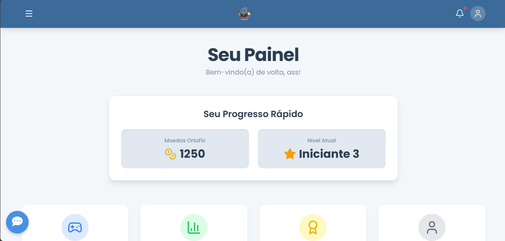

# OrtoFix: Plataforma Gamificada para o Ensino de Língua Portuguesa 🚀


O OrtoFix é uma aplicação web interativa e gamificada, projetada para auxiliar estudantes no aprendizado e na prática da ortografia e gramática da Língua Portuguesa de uma forma moderna e engajadora.

## 🎯 Sobre o Projeto

O ensino tradicional de regras ortográficas pode ser, muitas vezes, repetitivo e pouco motivador para os alunos. O OrtoFix nasceu com o objetivo de transformar esse cenário, utilizando conceitos de **gamificação** e **feedback inteligente** para criar uma experiência de aprendizado mais dinâmica, divertida e eficaz.

A plataforma oferece diferentes desafios que focam em habilidades específicas, mantendo o usuário engajado através de sistemas de pontuação, níveis e um mascote interativo que oferece dicas e incentivo.

## ✨ Funcionalidades Principais

*   🎮 **Atividades Interativas:**
    *   **Caça-Erros:** Desafios de identificação de erros ortográficos em textos, com modo clássico e contra o tempo.
    *   **Desafio de Acentuação:** Jogo rápido para testar o conhecimento sobre as regras de acentuação.
    *   **Ditado Interativo:** Atividade para praticar a audição e a escrita correta das palavras.
*   🧠 **Feedback com Inteligência Artificial:** Integração com a API do **Google Gemini** para fornecer análises e explicações detalhadas sobre os erros cometidos pelo usuário.
*   🏆 **Sistema de Gamificação:**
    *   Pontuação, níveis e sistema de vidas.
    *   Sequência diária de acesso para incentivar a prática contínua.
    *   Conquistas e estatísticas de desempenho.
*   🤖 **Mascote Interativo:** Um assistente virtual que guia o usuário, oferece dicas e reage ao seu desempenho.
*   🎨 **Design Moderno e Responsivo:** Interface limpa e agradável, totalmente adaptável a desktops, tablets e smartphones.

## 🛠️ Tecnologias Utilizadas

Este projeto foi construído utilizando tecnologias modernas de desenvolvimento web:

<div align="center">
  &nbsp;
  &nbsp;
  &nbsp;
  &nbsp;                                                &nbsp;
  &nbsp;
  
</div>

## 🚀 Como Executar o Projeto

Como este é um projeto front-end, você não precisa de um ambiente complexo para executá-lo.

1.  **Clone o repositório:**
    ```bash
    git clone https://github.com/seu-usuario/ortofix.git
    ```

2.  **Navegue até a pasta do projeto:**
    ```bash
    cd ortofix
    ```

3.  **Abra o arquivo da página principal:**
    *  Abra o arquivo `index.html`

## 🖼️ Telas da Aplicação

<!-- Adicione aqui screenshots das principais telas da sua aplicação! -->
| Painel Principal                               | Caça-Erros (Modo Clássico)             | Resultado com Feedback da IA           |
| ---------------------------------------------- | -------------------------------------- | -------------------------------------- |
|             |       |   |

## 👤 Autores:

*   **[Igor Gabriel Rodrigues Martins]** 
*   **[Gabriel Alves de Macedo]**
*   **[Pietro Freire Rezende dos Santos]**
*   **[Sarah Dias Venâncio ]**
*   **[Vinícius Dias Viana]**
